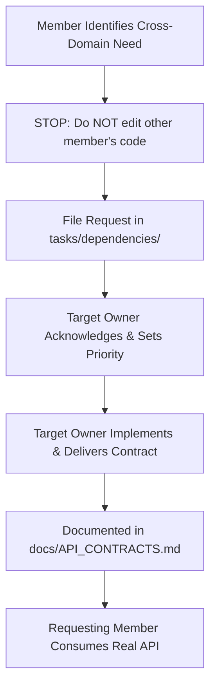

# CyberRiskOS — Integration Rules & Branch Governance

## Overview
This document specifies the branching model, pull request workflow, review standards, and completion handoff requirements for all CyberRiskOS contributors.

---

## 1. Git Branch Strategy

| Member | Dedicated Working Branch | Allowed Target Branch |
| :--- | :--- | :--- |
| **TANISH** | `feature/tanish-cyber-intelligence` | `main` |
| **HARSH** | `feature/harsh-enterprise-context` | `main` |
| **NISHIT** | `feature/nishit-frontend` | `main` |
| **INTEGRATION** | `main` | Production / Release Baseline |

### Core Git Rules
1. **Never work directly on `main`**: All work must occur on your assigned feature branch.
2. **Rebase Before Merging**: Before submitting a PR or requesting integration, pull and rebase against the latest `main`:
   ```bash
   git fetch origin
   git rebase origin/main
   ```
3. **Commit Only Owned Files**: Verify `git status` prior to staging. If an untracked change in another member's folder appears, unstage it immediately.
4. **Zero Broken Tests on Merge**: `npm test` (or `pytest` in `risk-engine/`) must pass 100% cleanly before a branch is merged into `main`.

---

## 2. Cross-Domain Dependency Protocol

When your feature requires data, endpoints, or schema fields provided by another domain:



1. **Do not modify another member's code** to "unblock yourself".
2. **File a formal request** in `tasks/dependencies/<OWNER>_REQUESTS.md`.
3. In the interim, use TypeScript interfaces and mock contracts in **test fixtures only**. Never commit synthetic mocks into the application code.

---

## 3. Database Migration Governance

- Each database migration must be a new file under `backend/src/db/migrations/`.
- Migrations are numbered sequentially using three digits: `001_...`, `002_...`, `003_...`.
- If two branches create migrations with conflicting numbers, the secondary merger must increment their file number to maintain chronological sequence.
- Migration format must include header metadata:
  ```sql
  -- Owner: <NAME>
  -- Purpose: <Clear description of tables, indexes, constraints created>
  ```
- **Never edit an existing migration file** that has already been merged into `main`.

---

## 4. Completion Handoff Specification

When a team member completes a major task or module, they must submit a formal completion handoff report using the following standard template:

```markdown
OWNER:               [Tanish / Harsh / Nishit]
MODULE:              [Module Name / Path]
STATUS:              [COMPLETED / READY_FOR_REVIEW]
FILES CREATED:
  - [file1]
  - [file2]
FILES MODIFIED:
  - [shared_file1]
DATABASE MIGRATIONS: [None / 00X_migration_name.sql]
ENDPOINTS:
  - [METHOD /api/path]
TEST RESULTS:        [X tests run, X tests passed, 0 failures]
LIVE VERIFICATION:   [Summary of live verification script execution and output]
KNOWN LIMITATIONS:   [Explicit boundary caveats, e.g., rate limits, pending joins]
DEPENDENCIES:        [Any dependent modules or unblocked tasks]
READY FOR MERGE:     [YES / NO]
```

---

## 5. Conflict Resolution Protocol

In the event that a merge conflict occurs:
1. **Stop immediately**: Do not perform a forced push (`git push -f`).
2. **Involve Tanish** (Architecture Coordinator & Integration Owner).
3. The member whose domain boundary owns the conflicted file makes the authoritative resolution decision.
4. If the conflict is in a shared file (`backend/src/server.ts`, `database/schema.sql`, `.env.example`), both involved members must review the resolution together.
