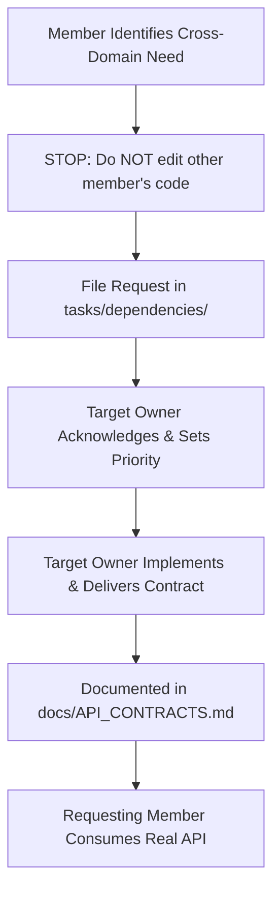

# CyberRiskOS — Integration Rules & Branch Governance

## Overview
This document specifies the branching model, pull request workflow, review standards, and completion handoff requirements for all CyberRiskOS contributors.

---

## 1. Git Branch Strategy

| Member | Phase 1 Dedicated Branch | Phase 2–9 Long-Running Dedicated Branch | Allowed Target |
| :--- | :--- | :--- | :--- |
| **TANISH** | `feature/tanish-cyber-intelligence` | `feature/tanish-risk-decision-engine` | `main` |
| **HARSH** | `feature/harsh-enterprise-context` | `feature/harsh-enterprise-financial-context` | `main` |
| **NISHIT** | `feature/nishit-frontend` | `feature/nishit-risk-product-ui` | `main` |
| **INTEGRATION** | `main` | `main` | Production / Release Baseline |

### Optional Task Sub-Branches (Merge into Member's Long-Running Feature Branch)
- **Tanish**:
  - `feature/tanish-risk-engine` (Phase 2)
  - `feature/tanish-financial-engine` (Phase 3)
  - `feature/tanish-scenarios` (Phase 4)
  - `feature/tanish-optimizer` (Phase 5)
  - `feature/tanish-attack-paths` (Phase 7B)
  - `feature/tanish-ai-assistant` (Phase 8)
- **Harsh**:
  - `feature/harsh-risk-inputs` (Phase 2)
  - `feature/harsh-financial-inputs` (Phase 3)
  - `feature/harsh-actions-catalog` (Phase 4/5)
  - `feature/harsh-compliance` (Phase 7A)
  - `feature/harsh-asset-dependencies` (Phase 7B)
- **Nishit**:
  - `feature/nishit-risk-overview` (Phase 2: N8)
  - `feature/nishit-financial-ui` (Phase 3: N9)
  - `feature/nishit-simulator-ui` (Phase 4: N10)
  - `feature/nishit-optimizer-ui` (Phase 5: N11)
  - `feature/nishit-executive-dashboard` (Phase 6: N12)
  - `feature/nishit-compliance-ui` (Phase 7A: N13)
  - `feature/nishit-attack-path-ui` (Phase 7B: N14)
  - `feature/nishit-ai-assistant-ui` (Phase 8: N15)

### Core Git Rules
1. **Never work directly on `main`**: All work must occur on your assigned feature branch or dedicated task sub-branch.
2. **Rebase Before Merging**: Before submitting a PR or requesting integration, pull and rebase against the latest `main`:
   ```bash
   git fetch origin
   git rebase origin/main
   ```
3. **Commit Only Owned Files**: Verify `git status` prior to staging. If an untracked change in another member's folder appears, unstage it immediately.
4. **Zero Broken Tests on Merge**: `npm test` (and `pytest` in `risk-engine/`) must pass 100% cleanly before a branch is merged into `main`.

---

## 2. Cross-Domain Dependency Protocol

When your feature requires data, endpoints, or schema fields provided by another domain:



1. **Do not modify another member's code** to "unblock yourself".
2. **File a formal request** in `tasks/dependencies/<OWNER>_REQUESTS.md`.
3. In the interim, use TypeScript interfaces and mock contracts in **test fixtures only**. Never commit synthetic mocks into the application code.

---

## 3. Database Migration Governance (Phases 2–9)

- Migrations `001` through `009` are complete and merged:
  - `001_nvd_ingestion.sql` (Tanish)
  - `002_cisa_kev_ingestion.sql` (Tanish)
  - `003_mitre_attack_ingestion.sql` (Tanish)
  - `004_vcdb_incidents.sql` (Tanish)
  - `005_organizations.sql` (Harsh)
  - `006_assets.sql` (Harsh)
  - `007_software.sql` (Harsh)
  - `008_cpe_matching.sql` (Harsh)
  - `009_security_controls.sql` (Harsh)
- **All new migrations must continue sequentially starting at `010_...`**:
  - `010_...`
  - `011_...`
  - `012_...`
- Every migration file must include authoritative owner header:
  ```sql
  -- =============================================================================
  -- Migration 010: Enterprise Financial Inputs & Impact Parameters
  -- Owner: HARSH
  -- Purpose: Storage of downtime hourly costs, recovery costs, and currency
  -- =============================================================================
  ```
  or
  ```sql
  -- =============================================================================
  -- Migration 011: Modeled Risk Results & Snapshot Persistence
  -- Owner: TANISH
  -- Purpose: Storage of calculated risk scores, factor contributions, and model versions
  -- =============================================================================
  ```
- **Never edit an existing migration file** that has already been merged into `main`. Forward migrations only.
- Before creating a migration, inspect `backend/src/db/migrations/` on latest `main` to claim the next unique integer.

---

## 4. Sequential Merge Order Per Phase

To eliminate integration lockups and contract drift, every phase with cross-domain dependencies follows a strict, sequential merge order:

```text
Step 1: HARSH merges Enterprise Input / Schema Contract
            ↓
Step 2: TANISH merges Risk Engine / Calculation API Contract
            ↓
Step 3: NISHIT merges Frontend UI Integration
            ↓
Step 4: Formal Phase Integration Gate Verification Pass
```

*Exception*: If a phase does not depend on Harsh changes (e.g. Threat Intel graph optimizations), Tanish may merge first.

---

## 5. Phase Integration Gates (Mandatory at End of EVERY Phase)

Before any phase is marked `COMPLETED` and before the next dependent phase begins, the team must execute and pass the **10-Point Integration Gate**:

1. **Backend Automated Tests**: 100% passing across all Jest test suites (`npm test` in `backend/`).
2. **TypeScript Compilation**: `npx tsc --noEmit` passes with 0 errors in `backend/` and `frontend/`.
3. **Python Risk-Engine Tests**: Pytest passes 100% in `risk-engine/` with zero lint/syntax errors.
4. **Frontend Production Build**: `npm run build` completes cleanly with 0 errors.
5. **Fresh Database Migration Run**: All migrations execute cleanly from `001` through latest with 0 statement errors.
6. **Live Runtime API Test**: Real HTTP requests succeed against all endpoints delivered in the phase.
7. **Frontend ↔ Backend Integration**: Web UI displays authentic live data from backend APIs with zero console runtime errors.
8. **No Synthetic Production Data Audit**: Confirmed zero mock CVEs, zero fake assets, zero fake financial numbers in production code.
9. **Secret & Config Audit**: No committed `.env` files or exposed credentials.
10. **API Documentation Alignment**: All new endpoints and DTOs fully documented in `docs/API_CONTRACTS.md`.

Do **NOT** start the next dependent phase until the current integration gate passes.

---

## 6. Completion Handoff Specification

When a team member completes a major task or module, they must submit a formal completion handoff report using the following standard template:

```markdown
OWNER:               [Tanish / Harsh / Nishit]
PHASE:               [Phase 2 - Phase 9]
MODULE:              [Module Name / Path]
STATUS:              [COMPLETED / READY_FOR_REVIEW]
FILES CREATED:
  - [file1]
  - [file2]
FILES MODIFIED:
  - [shared_file1]
DATABASE MIGRATIONS: [None / 01X_migration_name.sql]
ENDPOINTS:
  - [METHOD /api/path]
TEST RESULTS:        [X tests run, X tests passed, 0 failures]
LIVE VERIFICATION:   [Summary of live verification script execution and output]
KNOWN LIMITATIONS:   [Explicit boundary caveats, e.g., rate limits, pending joins]
DEPENDENCIES:        [Any dependent modules or unblocked tasks]
READY FOR MERGE:     [YES / NO]
```

---

## 7. Conflict Resolution Protocol

In the event that a merge conflict occurs:
1. **Stop immediately**: Do not perform a forced push (`git push -f`).
2. **Involve Tanish** (Architecture Coordinator & Integration Owner).
3. The member whose domain boundary owns the conflicted file makes the authoritative resolution decision.
4. If the conflict is in a shared file (`backend/src/server.ts`, `docs/API_CONTRACTS.md`, `docker-compose.yml`, `package-lock.json`), both involved members must review the resolution together.

